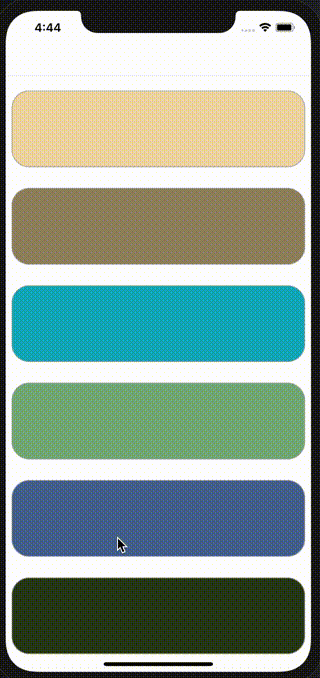
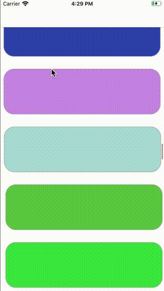
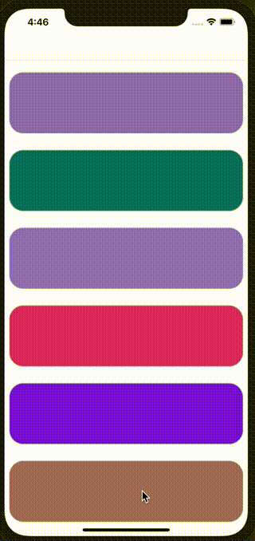
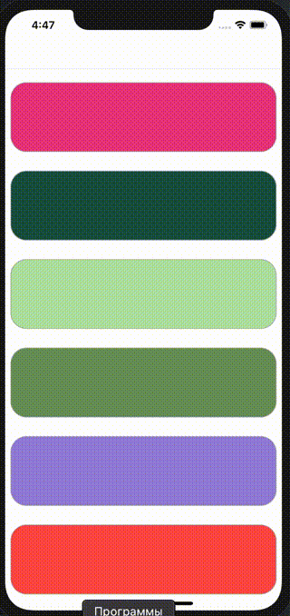
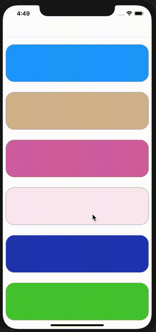

# TableViewAnimationKit
<p float="center">
    <div class="img-with-text">
        
        <p>moveRightBounce</p>
    </div>
    <div class="img-with-text">
        
        <p>moveLeftBounce</p>
    </div>
    <div class="img-with-text">
        
        <p>moveDownBounce</p>
    </div>
    <div class="img-with-text">
        
        <p>moveUpBounce</p>
    </div>
    <div class="img-with-text">
        
        <p>fadeIn</p>
    </div>
</p>

**TableViewAnimationKit** it is a library for quickly customizing animation of table cells.

## Features

- [X] Swift 4 and 5.
- [X] Works with every `UITableView`.
- [X] Configurable bounce effect.
- [X] Supports cell size changes

## Setup
The only thing you need to do is import the  `TableViewAnimationKit`, instantiate the animation and call the animation in the willDisplay method of the UITableViewDelegate.
```swift
import TableViewAnimationKit
```
```swift
var currentTableAnimation: TableAnimation = .fadeIn(duration: 0.85, delay: 0.03)
```
```swift
func tableView(_ tableView: UITableView, willDisplay cell: UITableViewCell, forRowAt indexPath: IndexPath) {
    // fetch the animation from the TableAnimation enum and initialze the TableViewAnimator class
    let animation = currentTableAnimation.getAnimation()
    let animator = TableViewAnimator(animation: animation)
    animator.animate(cell: cell, at: indexPath, in: tableView)
}
```

##### Find the above displayed examples in the `TableViewAnimationKitExample` folder.

## Installation

### CocoaPods
```ruby
pod 'TableViewAnimationKit', :git => 'https://github.com/BoykoMihail/TableViewAnimationKit.git'
```

### Carthage

BouncyLayout is available through [Carthage](https://github.com/Carthage/Carthage). To install
it, simply add the following line to your Cartfile:

```
github "https://github.com/BoykoMihail/TableViewAnimationKit"
```
